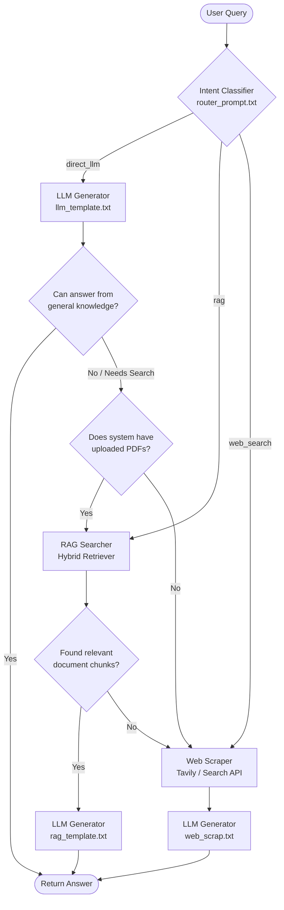

# Routed RAG System - Complete Workflow Connection Documentation

This document describes how the **Intent Classifier**, **Prompt Templates**, and the **LLM Generator** are connected to form a unified, robust multi-agent architecture with fallback rules.

---

## 1. Workflow Architecture Diagram

The flowchart below represents how a user query flows through the system, utilizes templates, executes retrieval, and cascades down to fallbacks (RAG or Web Search) if direct knowledge is insufficient.



Alternatively, here is the visual schema representing the query-to-template compilation flow:


---

## 2. Dynamic Workflow Segments & Connections

The workflow connects these segments:

### A. Intent Classification (The Router)
* **Trigger**: The FastAPI request arrives at the `/retriever/answer` endpoint inside [retriever_router.py](file:///c:/Users/somes/Desktop/PROJECT/MULTI-AGENT%20PROJECT/routers/retriever_router.py).
* **Processing**: The router calls `classify_intent` in [intent_classifier.py](file:///c:/Users/somes/Desktop/PROJECT/MULTI-AGENT%20PROJECT/core/intent_classifier.py), which reads `templates/router_prompt.txt` using the prompt loader.
* **Output**: The classifier determines the query intent (`direct_llm`, `rag`, or `web_search`) and performs pre-emptive checks (e.g., checks if any documents are uploaded in the system; if not, it automatically downgrades `rag` to `direct_llm` or `web_search`).

### B. Template Loading & Replacements
Once the router delegates to the LLM synthesis function (`generate_structured_answer` or `generate_direct_answer` in [llm.py](file:///c:/Users/somes/Desktop/PROJECT/MULTI-AGENT%20PROJECT/core/llm.py)), the system dynamically loads the corresponding template:

1. **Direct LLM Route (`direct_llm`)**:
   - Loads `templates/llm_template.txt` as the base system prompt instructions.
   - Schema validation instructions are appended to require Pydantic structured output.
   - Runs Groq chat completions using the loaded prompt and user query.
   
2. **RAG Route (`rag`)**:
   - Loads `templates/rag_template.txt`.
   - Replaces the `{rag_context}` placeholder with formatting retrieved document chunks (containing filename, page number, and chunk text) and replaces the `{user_query}` placeholder with the user query.
   - Runs Groq chat completions using the formatted prompt.

3. **Web Search Route (`web_search`)**:
   - Loads `templates/web_scrap.txt`.
   - Replaces the `{web_results}` placeholder with a formatted string containing web page titles, URLs, and scraped snippet contents, and replaces `{user_query}` with the user query.
   - Runs Groq chat completions using the formatted prompt.

---

## 3. Implementing Cascade Fallbacks

To ensure high reliability, the system employs **Cascading Fallbacks** when knowledge retrieval fails:

```python
def orchestrate_query_with_fallbacks(query: str, has_docs: bool) -> dict:
    # 1. Classify the user query intent
    intent_data = classify_intent(query, has_documents=has_docs)
    intent = intent_data.intent
    
    # 2. Path: Direct LLM
    if intent == "direct_llm":
        result = generate_direct_answer(query)
        
        # Check if the LLM states it lacks knowledge or needs search
        if getattr(result, "needs_search", False) or "not sure" in result.answer.lower():
            print("[Fallback] Direct knowledge insufficient. Re-routing...")
            intent = "rag" if has_docs else "web_search"
        else:
            return result

    # 3. Path: RAG Retrieval
    if intent == "rag":
        chunks = retrieve_chunks(query)
        if not chunks:
            print("[Fallback] No relevant RAG chunks found. Re-routing to Web Search...")
            intent = "web_search"
        else:
            return generate_structured_answer(query, chunks, intent="rag")

    # 4. Path: Web Search / Scraping
    if intent == "web_search":
        web_results = search_tavily(query)
        return generate_structured_answer(query, web_results, intent="web_search")
```
## rule of thumb